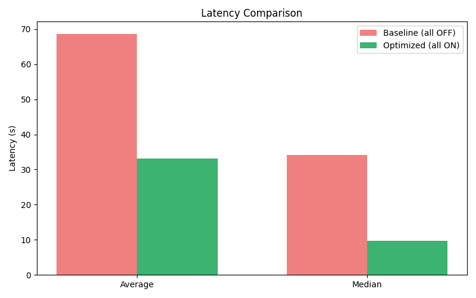
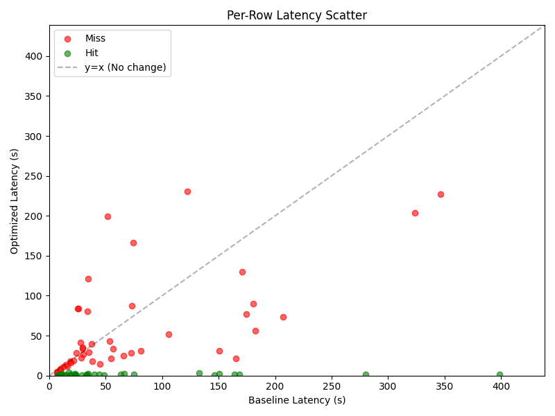

# HPML Final Project: AssetOpsBench: Temporal Semantic Caching and Workflow Optimization

> **Course:** High Performance Machine Learning
> **Semester:** Spring 2026
> **Instructor:** Dr. Kaoutar El Maghraoui

---

## Team Information

- **Team Name:** Team No. 9
- **Members:**
  - Krish Veera (krv2123) — *Initial MCP Workflow Optimization Architecture, Temporal Semantic Caching Integration and Debugging, Report Writing*
  - Alimurtaza Merchant (amm2640) — *Exploratory Data Analysis and Initial Semantic Caching Architecture, Report Writing*
  - Sajal Kumar Goyla (sg4607) — *Parallel Step Execution Script Architecture and Stress Testing, Overall Optimization Integration (Workflow + Query Level) and Stress Testing*
  - Shambhawi Bhure (sb5185) — *MCP Workflow Optimization Architecture Rewrite (Discovery Caching + Parallel Step Execution) and Stress Testing, Report Writing*

## Submission

- **GitHub repository:** [https://github.com/alimurtaza0411/Latency-Optimized-AssetOpsBench](https://github.com/alimurtaza0411/Latency-Optimized-AssetOpsBench/tree/master)
- **Final report:** [`deliverables/Team9_HPML_Final_Report.pdf`](deliverables/Team9_HPML_Final_Report.pdf)
- **Final presentation:** [`deliverables/Team9_HPML_Final_Presentation.pdf`](deliverables/Team9_HPML_Final_Presentation.pdf)
- **Experiment-tracking dashboard:** As discussed with and approved by the professor, our project did not require explicit profiling on platforms, hence a custom profiling script was used to measure wall-clock time for net speedup in terms of latency. Evidence for this is provided in the final presentation slides.

The final report PDF and the presentation file are checked into the `deliverables/` folder of this repository **and** uploaded to CourseWorks.

---

## 1. Problem Statement

This project optimizes AssetOpsBench (AOB), an industrial agent benchmark, focusing on improving its latency-sensitive Plan-Execute pipelines. The target is **inference latency**, as the multi-hop orchestration across specialized Model Context Protocol (MCP) servers (IoT, FMSR, TSFM, Work Order) incurs significant bottlenecks due to sequential tool discovery overhead and non-temporal caching. By introducing temporal semantic caching and parallel MCP workflow optimizations, we aim to drastically reduce the end-to-end latency and compute overhead of the standard plan-execute multi-agent pipeline.

---

## 2. Model/Application Description

- **Model architecture:** LLaMA-3.3 70B Instruct (via Watsonx API) for the primary Plan-Execute Agent. Qwen3-Embedded-0.6B (for Approximate Nearest Neighbor search) and Qwen3-Reranker-0.6B (for time-aware semantic judger).
- **Framework:** Python 3.12 (uv), MCP, asyncio.
- **Dataset:** Synthetic dataset generated using CouchDB backend for simulated assets.
- **Custom layers or modifications:** Implementation of a temporal semantic caching layer (VOLATILE, RELATIVE & ANCHORED, STATIC routing) and MCP workflow optimizations (Discovery-Phase Caching, Parallel Step Execution, Persistent Server Pool).
- **Hardware target:** Apple M4

---

## 3. Final Results Summary

| Metric                       | Baseline | Optimized | Δ (Improvement) |
| ---------------------------- | -------- | --------- | --------------- |
| Inference Latency (Median)   | 56.90 s  | 23.02 s   | 1.67× faster (40.0% reduction) |
| Cache Hit Speedup            | -        | -         | 30.6× faster inference |
| Discovery Overhead           | 2.34 s   | 0.008 s   | 296× faster     |

**Hardware:** Apple M4

**Headline result (one sentence):** *Across 20 benchmark queries with 3 runs per query, MCP workflow optimization reduces median end-to-end latency from 56.90s to 23.02s (1.67× speedup), and temporal-cache hits achieve a median 30.6× speedup.*

---

## 4. Repository Structure

```text
.
├── README.md
├── LICENSE
├── ASTERIA_CACHE.md         # Deep-dive documentation on the caching internals
├── pyproject.toml           # Python project & dependency configuration
├── uv.lock                  # Pinned dependencies (managed by uv)
├── bench_cache.py           # Ablation study benchmarking script
├── timer.py                 # Single-query execution and profiling script
├── generate_scenarios.py    # Synthetic dataset generator for cache scenarios
├── asteria/                 # Core temporal semantic caching engine
│   ├── cache.py             # Main cache orchestrator
│   ├── temporal_classifier.py  # VOLATILE / RELATIVE / ANCHORED / STATIC router
│   ├── semantic_judger.py   # Qwen3-Reranker-0.6B time-aware judger
│   ├── sine_index.py        # ANN index (Qwen3-Embedded-0.6B)
│   ├── embedding_model.py
│   ├── recalibrator.py
│   ├── semantic_element.py
│   ├── config.py
│   ├── workload.py
│   └── integrations/assetops/  # AssetOpsBench adapter
├── src/
│   ├── agent/plan_execute/  # DAG parallel executor & persistent MCP server pool
│   │   ├── executor_parallel.py  # Topological parallel step executor
│   │   ├── server_pool.py    # Persistent stdio MCP server pool
│   │   ├── planner.py
│   │   ├── runner.py
│   │   └── models.py
│   ├── couchdb/             # Dockerized CouchDB backend for simulated assets
│   ├── llm/                 # LiteLLM / WatsonX API wrapper
│   └── servers/             # MCP domain servers
│       ├── iot/             # IoT sensor data server
│       ├── fmsr/            # Failure Mode & Service Records server
│       ├── tsfm/            # Time-Series Forecasting & Monitoring server
│       ├── wo/              # Work Order server
│       ├── vibration/       # Vibration analysis server
│       └── utilities/       # Shared utility tools
├── ablation_plots/          # Result figures from ablation study
│   ├── latency_comparison.png
│   ├── hit_rate.png
│   ├── per_row_latency.png
│   └── speedup_distribution.png
├── deliverables/            # Final report and presentation
│   ├── Team9_HPML_Final_Presentation.pdf
│   └── Team9_HPML_Final_Report.pdf
└── docs/                    # Extended methodology & design notes
```

---

## 5. Reproducibility Instructions

### A. Environment Setup

```bash
# Clone
git clone https://github.com/alimurtaza0411/Latency-Optimized-AssetOpsBench.git
cd Latency-Optimized-AssetOpsBench

# Install dependencies using uv (reads pyproject.toml)
uv sync
source .venv/bin/activate
```

**System requirements:** Python 3.12 (managed by `uv`), Docker Desktop (for CouchDB), WatsonX API credentials. See `.env.public` for the full list of required environment variables and configure them in a `.env` file.

### B. Experiment Tracking Dashboard

> **🔗 Dashboard:** Not applicable.
>
> *Platform used:* A custom profiling script was used to measure wall-clock time. Evidence is provided in the slides.

### C. Dataset

Bring up the CouchDB backend and seed asset data:

```bash
cd src/couchdb
docker compose up -d
cd ../..
PYTHONPATH=src uv run python src/couchdb/init_asset_data.py
```
*Note: A valid WatsonX API key must be configured in the `.env` file for the project to run successfully. The full `main.json` dataset is not provided in the public repository; running the CouchDB setup automatically loads a subset of data.*

### D. Training

Not applicable. This project utilizes the Watsonx API for LLM inference and does not involve any local model training.

### E. Evaluation

Generate the datasets and run the full three-phase ablation workflow (Phase 1: Warm, Phase 2A: Baseline, Phase 2B: Cached):

```bash
# 1. Generate test data
PYTHONPATH=. uv run python generate_scenarios.py --output cache_seed.csv --max-rows 25 --paraphrases-per-row 2 --anchored-shifts-per-row 1 --seed 42
PYTHONPATH=. uv run python generate_scenarios.py --output cache_test.csv --max-rows 50 --paraphrases-per-row 2 --anchored-shifts-per-row 1 --seed 99

# 2. Run the benchmark
PYTHONPATH=src:. uv run python bench_cache.py \
    --seed-csv cache_seed.csv \
    --test-csv cache_test.csv \
    --sample-count 100 \
    --skip-summary \
    --max-seed-rows 20 \
    --sample-seed 7 \
    --ablation \
    --verbose
```

### F. Profiling

Run a single query to profile the pipeline and load the Qwen models:

```bash
PYTHONPATH=src:. uv run python timer.py --asteria --skip-summary "What happened yesterday with Chiller 6 at MAIN?"
```

### G. Quickstart: Reproduce the Headline Result

The following sequence reproduces the 1.67x speedup headline number end-to-end:

```bash
# 1. Generate test data
PYTHONPATH=. uv run python generate_scenarios.py --output cache_seed.csv --max-rows 25 --paraphrases-per-row 2 --anchored-shifts-per-row 1 --seed 42
PYTHONPATH=. uv run python generate_scenarios.py --output cache_test.csv --max-rows 50 --paraphrases-per-row 2 --anchored-shifts-per-row 1 --seed 99

# 2. Run the benchmark
PYTHONPATH=src:. uv run python bench_cache.py \
    --seed-csv cache_seed.csv \
    --test-csv cache_test.csv \
    --sample-count 100 \
    --skip-summary \
    --max-seed-rows 20 \
    --sample-seed 7 \
    --ablation \
    --verbose
```

---

## 6. Results and Observations

- *Optimization 1 (Discovery-Phase Caching):* 296× discovery overhead reduction (from 2.34s to 0.008s), attributable to caching tool catalogs to `.discovery_cache.json` on disk instead of repeatedly spawning subprocesses for the 6 MCP servers on every query.
- *Optimization 2 (Parallel Step Execution + Persistent Server Pool):* 40.0% overall median latency reduction (from 56.90s to 23.02s, a 1.67× speedup), attributable to grouping independent MCP plan steps into topological layers and executing them concurrently via `asyncio.gather()`, while a persistent `MCPServerPool` eliminates repeated subprocess spawn costs.
- *Optimization 3 (Temporal Semantic Caching):* 30.6× faster median inference on cache hits (45.0% cache hit rate over 80 test queries), attributable to bypassing the full LLM plan-execute loop for ANCHORED, RELATIVE, and STATIC queries using the Qwen3-Embedded-0.6B ANN search followed by Qwen3-Reranker-0.6B time-aware judging.
- *What did not work:* Cache misses incurred a mean overhead of ~15.78s due to the extra Qwen3 embedding and reranking inference steps, making misses slightly slower than the no-cache baseline. F1 score for cache hit classification was 0.64, indicating room for improvement in precision (0.75) and recall (0.56).




---

## 7. Notes

- Detailed internal caching documentation is available in `ASTERIA_CACHE.md`.
- Ensure all secrets (e.g. WatsonX API keys) are loaded from your `.env` file.

### AI Use Disclosure

*Per the HPML AI Use Policy (posted on CourseWorks). Required for every submission.*

**Did your team use any AI tool in completing this project?**

- [ ] No, we did not use any AI tool.
- [x] Yes, we used AI assistance as described below.

**Tool(s) used:** *Claude, ChatGPT, Gemini.*

**Specific purpose:** *As a learning aid for clarification, debugging, and polishing prose we drafted ourselves, per the permitted use policy.*

**Sections affected:** *General debugging and prose refinement across the report and presentation.*

**How we verified correctness:** *We verified all logic, optimizations, and results manually and ensured that AI was only used strictly within the permitted bounds of the course policy. We held regular internal meetings and meeting with our mentor, Dr. Dhaval Patel to discuss progress and ensure that our implementation was correct.*

By submitting this project, the team confirms that the analysis, interpretations, and conclusions are our own, and that any AI assistance is fully disclosed above. The same disclosure block appears as an appendix in the final report.

### License

IBM/AssetOpsBench is licensed under the Apache License. See [`LICENSE`](LICENSE).

### Citation

If you build on this work, please cite:

```bibtex
@misc{team9_assetopsbench_2026hpml,
  title  = {AssetOpsBench: Temporal Semantic Caching and Workflow Optimization},
  author = {Merchant, Alimurtaza and Veera, Krish and Goyla, Sajal Kumar and Bhure, Shambhawi},
  year   = {2026},
  note   = {HPML Spring 2026 Final Project, Columbia University},
  url    = {https://github.com/alimurtaza0411/Latency-Optimized-AssetOpsBench}
}
```

### Contact

Open a GitHub Issue or email *[Team - krv2123@columbia.edu, amm2640@columbia.edu, sg4607@columbia.edu, sb5185@columbia.edu]*.

### Submission Note

We received confirmation from the course professor that our submitted NeurIPS paper is sufficient as a final report, so we are submitting it as is instead of converting it to the IEEE format. We were also informed that our submission qualifies for the 10% bonus.

---

*HPML Spring 2026 — Dr. Kaoutar El Maghraoui — Columbia University*
